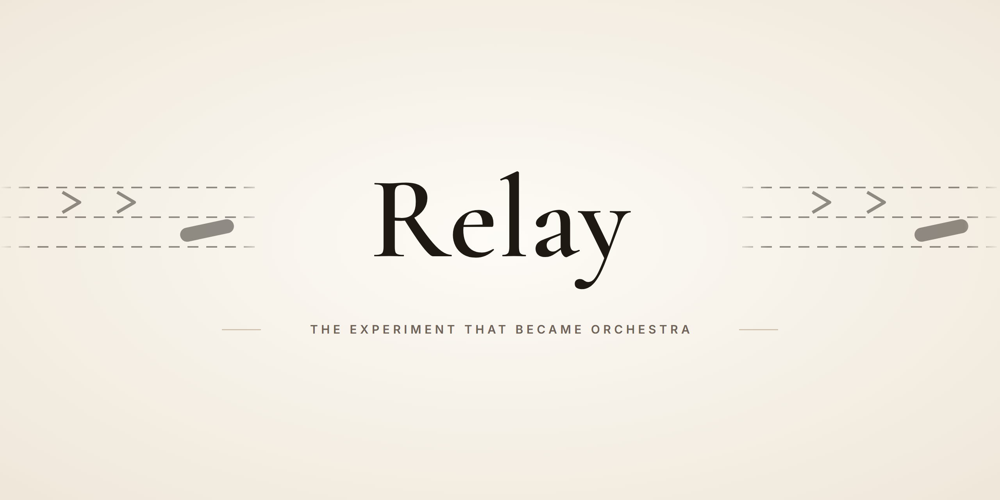

<p align="center">
  
</p>

<p align="center"><b>한국어</b> · <a href="README.en.md">English</a></p>

# Relay

> **설계와 리뷰는 사용자가 고른 메인 모델에 두고, 범위가 정해진 구현만 호스트별로 고정된 구현자 한 명에게 넘기는 스킬 플러그인입니다.**
> Codex와 Claude Code가 같은 스킬 15개를 씁니다. [Jesse Vincent의 Superpowers](https://github.com/obra/superpowers) 6.4.1을 기반으로 한 개인 포크입니다.

> **상태: 보관용. 더 이상 갱신하지 않습니다.** 마지막 버전(`6.4.1+claude.20260926`, `6.4.1+codex.20260926`)은 개인 환경에서 검증하던 실험판입니다.
> 회귀 검사 16개는 Linux·macOS에서 통과했고 Windows(Git Bash)에서는 일부 실패합니다. 사용량 절감 효과는 입증되지 않았습니다.

> **Relay는 [Orchestra](https://github.com/lsy041015/orchestra)로 이어집니다. 새로 쓰려면 Orchestra를 설치하세요. 이 README는 Relay가 어떤 프로젝트였는지 남겨 두는 기록입니다.**

---

## 목차

1. [왜 만들었나](#1-왜-만들었나)
2. [한눈에 보기](#2-한눈에-보기)
3. [동작 방식](#3-동작-방식)
4. [Orchestra에서 달라진 점](#4-orchestra에서-달라진-점)
5. [설치 (기록용)](#5-설치-기록용)
6. [저장소 구조](#6-저장소-구조)
7. [만들면서 고민한 것](#7-만들면서-고민한-것)
8. [한계](#8-한계)
9. [출처와 라이선스](#9-출처와-라이선스)

---

## 1. 왜 만들었나

스킬 워크플로로 긴 작업을 돌리면 모델과 추론 예산이 어디에 쓰이는지가 문제가 됩니다.

- **설계용으로 고른 모델이 단순 구현까지 맡습니다.** 메인 대화의 모델·추론 수준이 반복적인 코드 수정에도 그대로 쓰입니다.
- **에이전트가 계속 늘어납니다.** 원본 Superpowers의 `subagent-driven-development`는 작업마다 새 서브에이전트를 만들고, 작업마다 리뷰를 붙입니다(`UPSTREAM_README.md`).
- **호스트마다 위임 방식이 다릅니다.** Codex는 `spawn_agent`·`followup_task`, Claude Code는 `Agent`·`SendMessage`를 쓰고, 모델을 고정하는 위치도 다릅니다.

Relay는 역할을 둘로 나눴습니다. 요구사항 판단·설계·계획·리뷰·최종 검증은 사용자가 고른 메인 모델이 그대로 맡고, 범위가 정해진 구현만 호스트별 구현자 한 명에게 넘깁니다. 구현자에게는 목표·허용 파일·인수 조건·테스트·리포트 경로만 주고, 이전 대화 기록은 넘기지 않습니다.

## 2. 한눈에 보기

스킬 15개, 보조 스크립트, Claude Code용 구현자 에이전트 1개로 이루어진 플러그인입니다. MCP 서버, 외부 계정 연결, 자동 실행 훅은 없습니다.

| 기능 | 하는 일 |
|---|---|
| **구현 위임** | 범위가 정해진 구현 1건을 호스트별 구현자 한 명에게 맡깁니다. 작업 본문은 계획의 `### Task 1: 입력 검증` 같은 제목을 기준으로 파일로 뽑아 넘기고(`task-brief`), 리뷰에서 나온 수정도 같은 구현자에게 다시 보냅니다. |
| **두 호스트, 스킬 트리 하나** | 같은 `skills/`를 `.claude-plugin/plugin.json`과 `.codex-plugin/plugin.json`이 각각 읽습니다. 플러그인 이름은 양쪽 모두 `relay`, 스킬끼리는 `relay:<skill>`로 부릅니다. |
| **Worktree 격리** | 격리된 작업 공간을 만들고, 정리할 때는 Relay가 만든 worktree만 지웁니다. |
| **시각적 설계 보조** | 목업·다이어그램·비교안을 브라우저로 보여 주는 로컬 Node.js 서버입니다(`skills/brainstorming/scripts/server.cjs`). |
| **세션 진단** | 반복 작업, 계획 이탈, 예상 밖의 시간·토큰 사용을 대화 기록 근거로 사후 점검합니다(`diagnosing-superpowers`). |

| 용도 | 스킬 |
|---|---|
| 진입·설계·계획 | [using-superpowers](skills/using-superpowers/SKILL.md), [brainstorming](skills/brainstorming/SKILL.md), [writing-plans](skills/writing-plans/SKILL.md) |
| 구현·격리·테스트 | [subagent-driven-development](skills/subagent-driven-development/SKILL.md), [executing-plans](skills/executing-plans/SKILL.md), [using-git-worktrees](skills/using-git-worktrees/SKILL.md), [test-driven-development](skills/test-driven-development/SKILL.md) |
| 진단·검토·검증 | [systematic-debugging](skills/systematic-debugging/SKILL.md), [requesting-code-review](skills/requesting-code-review/SKILL.md), [receiving-code-review](skills/receiving-code-review/SKILL.md), [verification-before-completion](skills/verification-before-completion/SKILL.md), [diagnosing-superpowers](skills/diagnosing-superpowers/SKILL.md) |
| 종료·확장 | [finishing-a-development-branch](skills/finishing-a-development-branch/SKILL.md), [dispatching-parallel-agents](skills/dispatching-parallel-agents/SKILL.md), [writing-skills](skills/writing-skills/SKILL.md) |

## 3. 동작 방식

스킬은 Claude Code 스킬 형식의 Markdown(`SKILL.md`)입니다. 진입점 `using-superpowers`가 요청을 보고 다음 스킬로 보내며, 구현만 구현자에게 갑니다. 모델 선택은 스킬이 에이전트에게 요청하는 운영 규칙입니다. 플러그인이 메인 대화의 모델을 바꾸지는 않습니다.

```text
 메인 대화 (사용자가 고른 모델·추론 수준 그대로)
   using-superpowers ─▶ brainstorming (설계 미정) ─▶ writing-plans (여러 단계)
   task-brief ─▶ 계획에서 작업 하나를 파일로 추출
        │  brief: 목표·허용 파일·인수 조건·테스트·리포트 경로 (대화 기록 없음)
        ▼
 구현자 1명 (호스트별 고정 프리셋): 구현 → 테스트 → 자기 diff 점검 → 리포트
        │  Status: DONE | BLOCKED | NEEDS_DECISION
        ▼
 메인 대화: 리뷰(review-package) ─▶ 결함이 있으면 같은 구현자에게 후속 수정
        ▼
 verification-before-completion ─▶ finishing-a-development-branch (Relay가 만든 worktree만 정리)
```

| 호스트 | 구현자 프리셋 | 부르는 방법 |
|---|---|---|
| Codex | `gpt-6-luna` · `reasoning_effort = "xhigh"` · `fork_turns = "none"` | `spawn_agent(...)`, 후속 수정은 `followup_task` |
| Claude Code | `relay:implementer` 에이전트 · `model: claude-sonnet-5` · `effort: high` | `Agent(subagent_type="relay:implementer", ...)`, 후속 수정은 `SendMessage` |

- 작은 수정, 조회, 리뷰, 진단, 짧은 검증은 메인 대화가 직접 합니다. 설계가 정해진 작은 수정에는 설계 승인 절차를 더하지 않습니다.
- 병렬 구현은 사용자가 명시적으로 요청하고 파일·상태가 겹치지 않을 때만 합니다. 이때도 모든 구현자가 같은 프리셋을 씁니다.
- 검증은 실행 명령·대상 상태·종료 코드·결과로 확인합니다. 코드나 환경이 바뀌면 영향받은 검사를 다시 돌리고, 실패한 검사를 통과로 요약하지 않습니다.

## 4. Orchestra에서 달라진 점

메인 세션이 계획과 리뷰를 맡고 구현만 워커에게 넘기는 구조는 Orchestra도 같습니다. 달라진 것은 구현을 누구에게, 어떤 모델로 맡기느냐입니다.

| 항목 | Relay | Orchestra |
|---|---|---|
| 구현 담당 | 호스트마다 고정 프리셋 1개: Codex `gpt-6-luna`/`xhigh`, Claude Code `relay:implementer`(`claude-sonnet-5`/`high`) | 사용자가 고른 모델·effort의 Claude 서브에이전트 또는 Codex CLI 워커 |
| 작업 배정 | 범위가 정해진 구현을 구현자 1명에게 | Claude Code용 `orchestra:orchestrator` 스킬이 승인된 계획을 Easy / Medium / Hard / Hard (UI) 티어로 나눠 티어별로 배정 |
| 모델 설정 | `agents/implementer.md` frontmatter와 스킬 문서에 고정 | `~/.claude/orchestra.json`(사용자 기본값), `<project>/.orchestra.json`(프로젝트별) |
| Codex 워커 | Codex가 호스트일 때 `spawn_agent`로만 | `codex-worker.mjs`가 `codex exec`를 직접 실행하고, 실행 전후의 변경 파일로 범위를 기계적으로 검사. 수정 라운드는 `--resume <thread>` |
| 진행 표시 | 별도 규칙 없음 | 작업 목록에 `[Codex gpt-6-luna/high] Task 3: ...`처럼 모델·effort 표시 |
| 스킬 | 15개 | 16개 (`orchestrator` 추가) |
| 검증 | CI 없음, 실행 기록 없음 | CI(Ubuntu, macOS, Windows)와 처음부터 끝까지 돌린 데모 기록 1건(웹 피아노) |

## 5. 설치 (기록용)

새로 설치한다면 Relay 대신 Orchestra를 쓰세요. 필수 조건과 Codex 쪽 설치는 [Orchestra README](https://github.com/lsy041015/orchestra)에 있습니다. Relay, Orchestra, 원본 Superpowers를 **동시에 활성화하지 마세요.** 같은 이름의 스킬이 충돌합니다.

```bash
claude plugin marketplace add lsy041015/orchestra
claude plugin install orchestra@orchestra
```

아래는 Relay를 설치하던 방법입니다. **필요한 것**: Claude Code 또는 Codex CLI, Git, Bash. 시각적 설계 보조에는 Node.js, 긴 세션 진단의 일부 경로에는 별도 `context-mode` 도구가 필요할 수 있습니다.

```bash
claude plugin marketplace add lsy041015/relay     # Claude Code
claude plugin install relay@relay
codex plugin marketplace add lsy041015/relay      # Codex
codex plugin add relay@relay
python3 tests/test_task_brief.py                  # 회귀 검사 (저장소 루트)
python3 tests/test_worktree_instructions.py
python3 tests/test_worktree_cleanup.py
python3 tests/test_sdd_safety.py
```

- 설치 후 **새 세션**(Codex는 새 대화)을 시작해야 스킬을 읽습니다. Claude Code에서는 `relay:*` 스킬과 `relay:implementer` 에이전트가 활성화되고, `claude plugin list`로 확인합니다. 대화창의 `/plugin marketplace add lsy041015/relay` → `/plugin install relay@relay`나 Codex 플러그인 화면의 `Relay` 소스로도 설치할 수 있습니다.
- **업데이트**: `claude plugin marketplace update relay` 또는 `codex plugin marketplace upgrade relay` 뒤에 설치 명령(`install` / `add`)을 다시 실행합니다.
- **로컬 개발판**: Claude Code는 저장소를 `git clone`한 뒤 `claude plugin marketplace add ./relay`, `claude plugin install relay@relay`, `claude plugin validate ./relay`를 실행합니다. Codex는 원본을 `~/plugins/relay` 같은 위치에 복제하고 `~/.agents/plugins/marketplace.json` 개인 마켓플레이스에 항목을 추가합니다(`source.path`는 홈 디렉터리 기준 상대 경로, 예: `./plugins/relay`). 스킬을 고친 뒤에는 Codex의 `plugin-creator/scripts/update_plugin_cachebuster.py`로 캐시 식별자를 갱신하고 `codex plugin add relay@personal`로 다시 설치합니다. 설치 캐시를 직접 고치면 다음 업데이트에 사라집니다.
- **이전 이름에서 옮기는 경우**: 플러그인 이름은 `superpowers-astra-luna`에서 `relay`로 한 번 바뀌었습니다. 기존 `superpowers-astra-luna@relay`(또는 `@personal`)를 비활성화·제거한 뒤 `relay@relay`를 설치하세요.
- **사용 예**: "현재 메인 모델로 설계·리뷰해줘. 구현 범위가 정해지면 Relay 규칙에 따라 relay:implementer(Sonnet 5 high)에게 맡기고, 메인에서 테스트 근거와 최종 변경을 확인해줘." Codex에서는 구현자를 "GPT-6 Luna xhigh 구현자"로 적습니다.

## 6. 저장소 구조

```text
relay/
├── .claude-plugin/            # Claude Code 매니페스트(plugin.json)와 마켓플레이스(marketplace.json)
├── .codex-plugin/             # Codex 매니페스트, 아이콘·로고
├── .agents/plugins/           # Codex 마켓플레이스 항목 (marketplace.json)
├── agents/implementer.md      # Claude Code 구현자 (claude-sonnet-5 / high, Agent 도구 금지)
├── skills/                    # 두 호스트 공용 스킬 15개 (SKILL.md 형식 동일)
│   ├── */agents/openai.yaml   # Codex UI 표시 정보 (Claude Code는 무시)
│   ├── */scripts/             # task-brief, task-start, task-done, sdd-workspace, review-package, 설계 보조 서버
│   └── using-superpowers/references/   # 호스트별 호출 문법 (다른 호스트 문서 5개는 원본 호환용으로만 남김)
│       ├── codex-tools.md         # Codex: spawn_agent, followup_task
│       └── claude-code-tools.md   # Claude Code: Agent, SendMessage
├── tests/                     # 안전 스크립트 회귀 검사 (Python 4개 파일, 16개)
├── assets/                    # README 배너, 플러그인 아이콘 (원본 Superpowers 마크)
├── LICENSE                    # MIT, 원본 저작권(Jesse Vincent) 그대로
├── UPSTREAM_README.md         # 원본 Superpowers README
└── CODE_OF_CONDUCT.md         # 원본에서 물려받은 행동 강령
```

## 7. 만들면서 고민한 것

구현자에게 일을 맡기되 범위는 좁게, 삭제와 완료 기록은 확실할 때만 하도록 만든 장치들입니다.

- **중첩 위임은 설정으로 막았습니다.** `agents/implementer.md` frontmatter의 `disallowedTools: Agent` 때문에 Claude Code 구현자는 하위 에이전트를 만들 수 없습니다. 지시문으로 부탁하는 대신 도구 목록에서 뺐습니다.
- **모델을 몰래 바꾸지 않습니다.** Claude Code 스킬은 `Agent` 호출에 `model`을 넘기지 않고 frontmatter가 모델을 정합니다. 바꾸려면 이 파일의 `model`·`effort`만 고치면 됩니다. 호스트가 프리셋을 지원하지 않으면(모델 미지원, 에이전트 미설치) 다른 모델로 바꾸지 않고 메인에서 처리하거나 제한을 알립니다(`references/codex-tools.md`, `claude-code-tools.md`).
- **자기가 만든 worktree만 지웁니다.** 만들 때 Git 관리 디렉터리에 실제 경로를 적은 `relay-owned-worktree` 표식을 남기고, 정리할 때 표식과 실제 경로가 같을 때만 `git worktree remove`를 실행합니다. 디렉터리 이름은 소유 증거로 보지 않습니다(`finishing-a-development-branch/SKILL.md`, `tests/test_worktree_cleanup.py`).
- **실패를 완료로 적지 않습니다.** `sdd-workspace`는 작업 공간 경로의 심볼릭 링크를 거부하고 기존 `.gitignore` 내용을 보존합니다. `task-done`은 테스트 명령이 성공하면 출력이 없어도 진행 기록을 남기고, 실패하면 아무것도 기록하지 않습니다.
- **작업 본문은 파일로 넘깁니다.** `task-brief`는 계획에서 작업 하나를 파일로 뽑아 구현자가 한 번에 읽게 하므로, 작업 본문이 메인 대화의 컨텍스트를 거치지 않습니다. 코드 블록 안의 예시 제목은 작업 경계로 보지 않고, 닫히지 않은 코드 블록이 있으면 추출을 거부합니다.
- **리뷰 프롬프트는 메인의 체크리스트입니다.** `task-reviewer-prompt.md`는 별도 에이전트로 띄우지 않고 메인 대화가 직접 쓰는 워크시트입니다(`subagent-driven-development/SKILL.md`).
- **같은 원인으로 두 번 실패하면 멈춥니다.** 재시도를 이어 가지 않고 메인이 원인이나 계획을 다시 봅니다. 다른 시각을 얻겠다고 새 구현자를 만들지 않습니다.

## 8. 한계

보관된 실험판이라 아래 한계는 앞으로도 고치지 않습니다.

- **사용량 절감은 입증되지 않았습니다.** 검토용 에이전트 생성과 전체 대화 복제를 줄이도록 설계했을 뿐, 절감률은 측정하지 않았고 보장하지 않습니다. 비교하려면 Codex는 계정의 7일 창 사용률(`usedPercent`), Claude Code는 플랜 사용량을 수행 작업량·모델·추론 설정·재시도·검증 범위와 함께 기록해야 합니다. 토큰 수나 실행 시간을 한도 절감률로 환산하지 않습니다.
- **Windows(Git Bash)에서는 테스트가 일부 실패합니다.** cp949 기본 인코딩(`PYTHONUTF8=1`로 일부 완화), 심볼릭 링크 생성 권한, CRLF 줄바꿈 차이 때문이며 스킬 로직 결함은 아닙니다. Linux·macOS에서는 회귀 검사 16개, 스킬 frontmatter 검사 15개, Bash 문법 검사 8개를 통과했습니다.
- **테스트 범위가 좁고 CI가 없습니다.** 모든 스킬의 실제 모델 위임과 모든 실패 복구 경로를 검증하지 않습니다.
- **Worktree 대체 절차는 GNU `realpath -m`에 의존합니다.** Orchestra는 이 검사가 macOS에서 실패하는 문제를 고쳤지만 Relay에는 반영되지 않았습니다. 이 명령이 없는 환경에서는 호스트의 기본 worktree 기능을 먼저 쓰세요.
- **구현자는 호스트마다 하나로 고정입니다.** Claude Code 세션에서 Codex에 구현을 맡기거나 작업 난이도별로 모델을 고르는 기능은 없습니다(Orchestra에서 추가).

## 9. 출처와 라이선스

- **원본**: [Jesse Vincent의 Superpowers](https://github.com/obra/superpowers) 6.4.1. 원본 저작권과 [MIT 라이선스](LICENSE)를 보존했습니다. `LICENSE`의 저작권자는 Jesse Vincent(2025)뿐이며, 원본 설명은 [UPSTREAM_README.md](UPSTREAM_README.md)에 있습니다. [CODE_OF_CONDUCT.md](CODE_OF_CONDUCT.md)도 원본에서 물려받은 Prime Radiant Community Code of Conduct입니다. 공식 OpenAI·Anthropic·Superpowers 배포판이 아닙니다.
- **아이콘**: `assets/app-icon.png`, `assets/superpowers-small.svg`와 `.codex-plugin/assets/`의 `logo.png`, `composer-icon.svg`는 원본 Superpowers의 마크를 그대로 쓴 것입니다. Relay 고유의 브랜딩이 아닙니다.
- **이름의 이력**: `superpowers-astra-luna` → `relay` → [`orchestra`](https://github.com/lsy041015/orchestra). 문제 보고와 제안은 [Orchestra Issues](https://github.com/lsy041015/orchestra/issues)로 보내 주세요.

---

<p align="center"><sub>LSY.KOR · <a href="https://github.com/lsy041015">다른 프로젝트 보기</a></sub></p>
